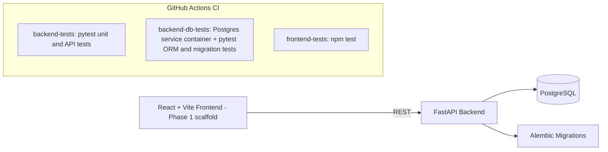

# RoboOps

## Honest Project Status


| Phase | Scope | Status |
|-------|-------|--------|
| Phase 1 | React/Vite + FastAPI scaffold, Docker Compose, health check | Complete |
| Phase 2 | PostgreSQL schema, Alembic migrations, seed data, isolated test databases | Complete |
| Phase 3 | Core CRUD APIs for robots, robot_models, and sites | Complete |
| Phase 4 | Read-only fleet dashboard APIs (6 endpoints) | Complete |
| Phase 5 | Authentication and RBAC | Planned |
| Phase 6 | Kafka telemetry streaming and a full React dashboard UI | Planned |

Known limitation: authentication and authorization are not yet implemented on any route. This is a deliberate, documented scope decision - see SECURITY.md and docs/adr/0001-defer-authentication.md.

### Architecture



### Implemented API surface
- /api/v1/sites - full CRUD
- /api/v1/robot-models - full CRUD
- /api/v1/robots - full CRUD
- /api/v1/dashboard/* - 6 read-only aggregate endpoints (summary, robot-status, latest-alerts, health-summary, site-summary, maintenance-summary)
- /health - service health check

Note: technicians, sensors, sensor_readings, maintenance_schedules, maintenance_records, and alerts have database tables and models (Phase 2) but do not yet have dedicated CRUD routers.

Robotics Fleet Monitoring & Predictive Maintenance Platform.

## Phase 1

React + Vite frontend, FastAPI backend, PostgreSQL via Docker Compose, route placeholders, health endpoint, and starter tests.

## Quick start

```bash
cp .env.example .env
docker compose up --build
```

Open http://localhost:5173 and http://localhost:8000/docs.

## Manual run

Backend: `cd backend`, create/activate a virtual environment, `pip install -r requirements.txt`, then `uvicorn app.main:app --reload`.

Frontend: `cd frontend`, `npm install`, then `npm run dev`.

## Phase 2: database foundation

Phase 2 adds the persistent database layer on top of the Phase 1 scaffolding: SQLAlchemy 2.x models, Alembic migrations, Pydantic v2 schemas, a deterministic seed script, and dedicated test databases. Nothing in this section changes Phase 1 routes or behavior.

### Database architecture

The backend uses a single database package, `app/database` (there is no `app/db`), which exposes a SQLAlchemy engine, a session factory, a declarative `Base`, and a FastAPI `get_db` dependency. All ORM models live under `app/models` and import `Base` from `app.database`.

### The nine tables

RoboOps Phase 2 introduces nine tables that model a fleet of robots and their predictive-maintenance history:

- `sites` - physical locations/depots where robots are deployed.
- `robot_models` - a reference catalogue of robot models/types (manufacturer, category).
- `robots` - the fleet itself. Each robot has a unique `robot_code` (e.g. `RBT-001`), belongs to a site and a model, and has a status (`active`, `idle`, `maintenance`, `offline`, `decommissioned`).
- `technicians` - maintenance staff who service robots.
- `sensors` - sensors attached to a robot (battery, temperature, vibration, motor load, navigation error).
- `sensor_readings` - time-series metric values recorded by a sensor.
- `maintenance_schedules` - planned/upcoming maintenance work for a robot.
- `maintenance_records` - completed maintenance history, optionally linked back to a schedule and a technician.
- `alerts` - predictive-maintenance/anomaly alerts raised for a robot, optionally tied to a specific sensor.

Full column-level documentation lives in [`docs/database-schema.md`](docs/database-schema.md).

### Migrations

Alembic is configured in `backend/alembic.ini` with the environment defined in `backend/alembic/env.py`. The Alembic environment reads the target database exclusively from the `DATABASE_URL` environment variable (it never falls back to a hard-coded default), so the same migration can be pointed at the primary, local, Docker, or CI database simply by setting that variable before running Alembic. The single initial migration (`backend/alembic/versions/0001_initial_schema.py`) creates all nine tables, their enum types, indexes, and foreign keys, and its `downgrade()` cleanly reverses every step.

### Local vs. Docker vs. CI database URLs

Three logical databases are used everywhere: the primary application database, a dedicated ORM test database, and a dedicated migration test database. The hostname and port differ depending on where the code is running:

| Context | Host | Port |
| --- | --- | --- |
| Local (outside Docker) | `localhost` | `5433` |
| Inside Docker Compose | `postgres` | `5432` |
| GitHub Actions CI | `localhost` | `5432` |

`.env.example` documents the local (non-Docker) URLs using `localhost:5433`, because that is the host-mapped port for the `postgres` service. When you run `docker compose up`, `docker-compose.yml` explicitly overrides `DATABASE_URL`, `TEST_DATABASE_URL`, and `MIGRATION_TEST_DATABASE_URL` for the `backend` container to use `postgres:5432` instead - the backend container never talks to `localhost`. GitHub Actions sets its own job-level values using `localhost:5432`, matching the Postgres service container port mapping used in CI.

### Dedicated ORM and migration test databases

Regular ORM tests (`backend/tests/conftest.py`) run exclusively against `TEST_DATABASE_URL`. Each test runs inside an outer transaction using the SQLAlchemy 2.x `join_transaction_mode="create_savepoint"` pattern, so a test may call `session.commit()` and its data is still rolled back at the end of the test - no private SQLAlchemy attributes are used. The one destructive test, `backend/tests/test_alembic_migration.py`, is the only test allowed to drop and recreate the `public` schema, and it does so exclusively against `MIGRATION_TEST_DATABASE_URL`. `TEST_DATABASE_URL`, `MIGRATION_TEST_DATABASE_URL`, and `DATABASE_URL` are validated at test start-up and the suite fails immediately with a clear error if any of them is missing or if any two of them are equal.

### PostgreSQL initialization script behavior

`docker/postgres-init/01-create-test-databases.sql` creates `roboops_test_db` and `roboops_migration_test_db` in addition to the primary `roboops_db` (which is created via the `POSTGRES_DB` environment variable). **This script only runs the very first time the `postgres` data volume is created** - PostgreSQL's docker-entrypoint-initdb.d mechanism does not re-run initialization scripts against an existing volume. If you already have a `roboops-platform` Postgres volume from before Phase 2, use the commands below to create the two test databases manually.

#### Creating the test databases on an existing volume

```bash
docker compose exec postgres psql -U roboops_user -d postgres -tAc "SELECT 1 FROM pg_database WHERE datname='roboops_test_db'" | grep -q 1 || docker compose exec postgres psql -U roboops_user -d postgres -c "CREATE DATABASE roboops_test_db;"
docker compose exec postgres psql -U roboops_user -d postgres -tAc "SELECT 1 FROM pg_database WHERE datname='roboops_migration_test_db'" | grep -q 1 || docker compose exec postgres psql -U roboops_user -d postgres -c "CREATE DATABASE roboops_migration_test_db;"
```

**Warning:** `docker compose down -v` deletes the `postgres` service's data volume, which permanently deletes your local PostgreSQL data (including anything seeded). Only use `-v` when you deliberately want a clean slate, and prefer the manual commands above over recreating the volume on an existing environment.

### Deterministic seed behavior

`backend/scripts/seed.py` is genuinely deterministic and idempotent, not just described as such:

- every entity ID is derived with `uuid.uuid5` from a fixed namespace UUID plus a natural key (e.g. `"robot:RBT-001"`) - `uuid.uuid4` (random) is never used.
- every timestamp is derived from a fixed, timezone-aware `REFERENCE_TIME` constant - `datetime.now()`/`utcnow()` are never used.
- `random.seed(SEED)` is called inside `run()`, before any randomised sensor-reading jitter is generated, so metric values are reproducible.
- Python's `hash()` builtin is never used anywhere in the script (it is randomised per-process and would break determinism).
- re-running the script deletes only the exact `RBT-001` through `RBT-012` seed robots (their dependent sensors/readings/schedules/records/alerts cascade-delete with them) before re-inserting - it never uses a broad match such as `Robot.robot_code.like("RBT-%")`. Shared reference data (sites, robot models, technicians) is looked up by natural key and reused rather than duplicated.

Because of this, running the seed script twice in a row produces identical IDs, timestamps, metric values, and row counts. All seed data (site names, robot codes, technician names/emails, etc.) is synthetic and fictional.

## Complete verification order

Run the following in order from the repository root:

```bash
docker compose up -d --build
docker compose ps

# Only needed if the postgres volume already existed before Phase 2:
docker compose exec postgres psql -U roboops_user -d postgres -tAc "SELECT 1 FROM pg_database WHERE datname='roboops_test_db'" | grep -q 1 || docker compose exec postgres psql -U roboops_user -d postgres -c "CREATE DATABASE roboops_test_db;"
docker compose exec postgres psql -U roboops_user -d postgres -tAc "SELECT 1 FROM pg_database WHERE datname='roboops_migration_test_db'" | grep -q 1 || docker compose exec postgres psql -U roboops_user -d postgres -c "CREATE DATABASE roboops_migration_test_db;"

docker compose exec backend alembic upgrade head
docker compose exec postgres psql -U roboops_user -d roboops_db -c "\dt"
docker compose exec backend python -m scripts.seed
docker compose exec postgres psql -U roboops_user -d roboops_db -c "SELECT COUNT(*) FROM robots;"
docker compose exec backend pytest -v
curl http://localhost:8000/health
```

Expected results: `docker compose ps` shows `postgres`, `backend`, and `frontend` as healthy/running; `\dt` lists all nine tables; the seed command prints a per-table row-count summary ending in a `total` line; `SELECT COUNT(*) FROM robots;` returns `12`; `pytest -v` passes, including the ORM tests and the destructive migration round-trip test; and `curl http://localhost:8000/health` returns `{"status":"ok","service":"roboops-backend"}`.

### Alembic round-trip validation

```bash
docker compose exec backend alembic downgrade base
docker compose exec backend alembic upgrade head
```

**Warning:** running `alembic downgrade base` against the primary development database (`DATABASE_URL`/`roboops_db`) drops every table it manages, including any data you have in it. Only do this when you are certain it is safe to lose that data. Whenever possible, prefer verifying the destructive upgrade/downgrade round trip against the dedicated migration test database instead - that is exactly what `docker compose exec backend pytest -v` already does via `test_alembic_migration.py` and `MIGRATION_TEST_DATABASE_URL`, with no risk to `roboops_db`.
