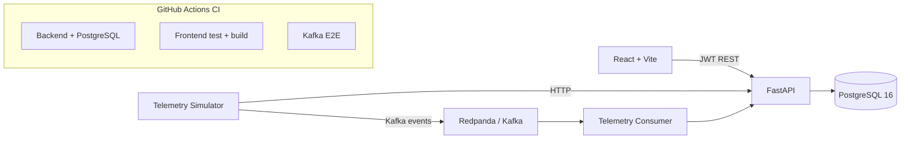

# RoboOps

## Honest Project Status


### Live hosted demo

- Frontend: https://roboops-platform.vercel.app
- API documentation: https://roboops-api.onrender.com/docs
- Database-backed readiness: https://roboops-api.onrender.com/health/ready

The hosted demo uses the read-only `demo@roboops.example` viewer account. Its
password is stored only in Render and is not committed to this repository.
Render's free instance may need a short cold-start period after inactivity.

| Phase | Scope | Status |
|-------|-------|--------|
| Phase 1 | React/Vite + FastAPI scaffold, Docker Compose, health check | Complete |
| Phase 2 | PostgreSQL schema, Alembic migrations, seed data, isolated test databases | Complete |
| Phase 3 | Core CRUD APIs for robots, robot_models, and sites | Complete |
| Phase 4 | Read-only fleet dashboard APIs (6 endpoints) | Complete |
| Phase 5 | React Enterprise Dashboard (frontend wired to the Phase 4 APIs) | Complete |
| Phase 6 | JWT authentication, read protection, write RBAC, role-aware UI | Complete |
| Phase 7 | Idempotent telemetry ingestion and stateful simulator | Complete |
| Phase 8 | Kafka producer/consumer, Redpanda E2E path, retry and DLQ handling | Complete |
| Phase 9 | Telemetry-driven robot health analytics | Complete |
| Phase 10 | Anomaly detection, health trends, and query scalability | Complete |
| Phase 11 | ML feature pipeline, training gate, and truthful condition scoring | Complete |
| Phase 12 | Reproducible builds and recruiter-facing evidence | Complete |
| Phase 13 | Authenticated alert lifecycle API and role-aware UI | Complete |
| Phase 14 | Condition-signal alert synchronization and database deduplication | Complete |
| Phase 15 | Prometheus HTTP metrics, request correlation, and structured access logs | Complete |
| Phase 16 | Database readiness probes and production container builds | Complete |
| Phase 17 | Full-stack container smoke test with real auth and seeded data | Complete |
| Phase 18 | Playwright browser E2E for authentication and operations UI | Complete |
| Phase 19 | Versioned GHCR images, SBOM/provenance, and GitHub release | Complete |
| Phase 20 | CodeQL, dependency audits, container scanning, and Dependabot | Complete |
| Phase 21 | Hosted Vercel frontend, Render API, Neon PostgreSQL, and deployment verification | Complete |
| Phase 22 | Bounded login and telemetry-write rate limiting with retry headers | Complete |
| Phase 23 | Database-backed revocable JWT sessions and server-side logout | Complete |

RoboOps is an actively developed portfolio system with a public recruiter demo,
not a claimed enterprise production service. It uses synthetic seed/simulator
data and does not claim uptime, cost savings, failure-prediction accuracy,
remaining useful life, or business impact that has not been measured. Current
production gaps include managed secret rotation, refresh-token rotation,
shared multi-replica rate limiting, and hosted Kafka with TLS/SASL/ACLs.
Kafka/Redpanda remains a local and CI-tested integration rather than a
hosted-demo dependency.

### Architecture



### Implemented API surface
- /api/v1/sites - full CRUD
- /api/v1/robot-models - full CRUD
- /api/v1/robots - full CRUD
- /api/v1/dashboard/* - 6 read-only aggregate endpoints (summary, robot-status, latest-alerts, health-summary, site-summary, maintenance-summary)
- /api/v1/telemetry/readings - idempotent operator/admin telemetry ingestion
- /api/v1/telemetry/robots/{robot_id}/latest - authenticated latest readings per sensor
- /api/v1/telemetry/sensors/{sensor_id}/readings - authenticated bounded history
- /api/v1/dashboard/telemetry-* - authenticated anomaly, trend, health, and condition analytics
- /api/v1/alerts - authenticated, filterable persisted alert list
- /api/v1/alerts/sync-conditions - operator/admin condition-to-alert synchronization
- /api/v1/alerts/{alert_id}/resolve - idempotent operator/admin resolution workflow
- /api/v1/auth/login, /api/v1/auth/me, and /api/v1/auth/logout - revocable JWT session flow
- /health - service health check
- /health/ready - PostgreSQL-backed readiness check
- /metrics - Prometheus process and low-cardinality HTTP telemetry

Login attempts and authenticated telemetry writes use configurable fixed-window
limits and return `429`, `Retry-After`, and `X-RateLimit-*` headers when
exceeded. The current limiter is bounded and process-local; it is not presented
as a distributed quota across multiple replicas.

Issued access tokens are tied to database-backed sessions through a signed `jti`
claim. Logout revokes the presented session server-side; see
[`docs/authentication.md`](docs/authentication.md) for the exact lifecycle and
explicit limitations.

Note: technicians, sensors, sensor_readings, maintenance_schedules, and maintenance_records have database tables and models but do not yet have dedicated CRUD routers. Alerts expose an operational list, condition sync, and resolution workflow rather than unrestricted CRUD.

Robotics Fleet Monitoring & Predictive Maintenance Platform.

## Phase 1

React + Vite frontend, FastAPI backend, PostgreSQL via Docker Compose, route placeholders, health endpoint, and starter tests.

## Phase 5: React Enterprise Dashboard

Phase 5 replaces the Phase 1 frontend route placeholders with a real dashboard wired to the live Phase 4 APIs. It adds an API client with request timeout handling (`AbortController`, 8s default), a `useDashboardData` hook, and dashboard panels for fleet summary, robot status, recent alerts, robot health, maintenance, and site summary. All page routes are lazy-loaded via `React.lazy` + `Suspense` to keep the initial bundle small. No fabricated metrics are shown: where the backend does not expose an aggregate health score, the UI reports it as unavailable rather than inventing a number. Covered by 10 frontend test files (32 tests).

## Quick start

```bash
cp .env.example .env
docker compose up --build
```

Open http://localhost:5173 and http://localhost:8000/docs.

## Manual run

Backend: `cd backend`, create/activate a virtual environment, `pip install -r requirements.txt`, copy the repository `.env.example` to `.env`, then run `uvicorn app.main:app --reload`.

Frontend: `cd frontend`, `npm ci`, then `npm run dev`.

### Verification

The full backend suite requires PostgreSQL because it verifies PostgreSQL-specific UUIDs, enums, migrations, transaction isolation, and set-based analytics. The supported local verification path is:

```bash
docker compose up -d postgres redpanda
docker compose run --rm redpanda-topic-init
docker compose run --rm backend alembic upgrade head
docker compose run --rm backend pytest -v
cd frontend && npm ci && npm test && npm run build
```

GitHub Actions independently runs backend tests, database/migration tests, frontend tests/build, and a real Kafka-to-PostgreSQL smoke test. A green badge reflects those checks; it is not a claim of production uptime.

CI also starts the production backend and Nginx frontend containers against a
fresh PostgreSQL database, runs migrations, loads the deterministic synthetic
fleet, bootstraps a CI-only admin, and verifies login, identity, dashboard
summary, readiness, frontend SPA routing, and Prometheus metrics. The bootstrap
command never resets an existing account's password or role.

Playwright then exercises the rendered application in Chromium: anonymous
route protection, rejected credentials, admin login, the real 12-robot seeded
dashboard, alert navigation, server-side logout, and rejected reuse of the
revoked token. Failure-only traces, screenshots, and video are retained as
short-lived CI artifacts for diagnosis.

### Phase 7B: HTTP telemetry simulator

The development simulator generates stateful battery and temperature readings
and sends them through `POST /api/v1/telemetry/readings`. It never writes to
PostgreSQL directly. Configure `ROBOOPS_API_URL`,
`ROBOOPS_SIMULATOR_EMAIL`, `ROBOOPS_SIMULATOR_PASSWORD`, and
`ROBOOPS_SIMULATOR_SENSORS` as a JSON array of explicit sensor, robot, type,
and unit records. Optional settings include `ROBOOPS_SIMULATOR_INTERVAL_SECONDS`,
`ROBOOPS_SIMULATOR_SEED`, and `ROBOOPS_SIMULATOR_TIMEOUT_SECONDS`.

From `backend/`, send one cycle or a fixed number of cycles:

```bash
python -m scripts.telemetry_simulator --once
python -m scripts.telemetry_simulator --cycles 5 --interval 10
```

The simulator uses the existing human-user operator JWT flow for development;
this is not device authentication. Kafka and device identity are future work.

### Phase 8A: Kafka telemetry producer

The simulator also supports an explicit Kafka transport for versioned telemetry
events. HTTP remains the default and continues to use the existing operator
JWT flow. Kafka mode does not log in over HTTP or carry a JWT:

```bash
python -m scripts.telemetry_simulator --transport kafka --once
python -m scripts.telemetry_simulator --transport kafka --cycles 5 --interval 10
```

Configure `KAFKA_BOOTSTRAP_SERVERS`, `KAFKA_TELEMETRY_TOPIC`, and
`KAFKA_CLIENT_ID`. Phase 8A publishes compact JSON envelope version 1 events
with `acks=all` and bounded delivery retries. Delivery is not claimed to be
exactly once.

### Phase 8B: Kafka telemetry consumer

The standalone consumer validates version-1 telemetry events, maps them to the
existing `TelemetryReadingCreate` schema, and persists through the existing
telemetry service. It disables automatic offset commits and commits only after
successful persistence or idempotent duplicate handling:

```bash
python -m scripts.telemetry_consumer
```

Configure `KAFKA_BOOTSTRAP_SERVERS`, `KAFKA_TELEMETRY_TOPIC`,
`KAFKA_CONSUMER_GROUP`, `KAFKA_POLL_TIMEOUT_SECONDS`, and
`KAFKA_CONSUMER_CLIENT_ID`. Phase 8B uses at-least-once processing and commits
offsets only after persistence or idempotent duplicate handling.

### Phase 8C: local Redpanda end-to-end telemetry

Phase 8C adds a real pinned Redpanda broker for local development. The path is:

```text
Telemetry simulator / Kafka producer
    -> roboops.telemetry.readings.v1
    -> KafkaTelemetryConsumer
    -> telemetry_service
    -> PostgreSQL
```

Start the local services and initialize the single-partition topic:

```bash
docker compose up -d postgres redpanda
docker compose run --rm redpanda-topic-init
docker compose run --rm backend alembic upgrade head
docker compose run --rm backend python -m scripts.seed
```

Run the consumer in one terminal, using the Compose network name, then run the
simulator from the host with `KAFKA_BOOTSTRAP_SERVERS=localhost:9092`:

```bash
docker compose run --rm -e KAFKA_BOOTSTRAP_SERVERS=redpanda:9092 backend python -m scripts.telemetry_consumer
cd backend
KAFKA_BOOTSTRAP_SERVERS=localhost:9092 python -m scripts.telemetry_simulator --transport kafka --once
```

Verify the reading through the existing authenticated telemetry APIs or the
PostgreSQL workflow. Phase 8C uses at-least-once delivery and
`source_event_id` application-level idempotency. Phase 8D classifies malformed,
invalid, unknown-sensor, decommissioned-robot, and idempotency-conflict events
as permanent failures, publishes them to
`roboops.telemetry.readings.dlq.v1`, and commits the original offset only after
DLQ acknowledgement. Transient persistence failures are retried boundedly and
remain uncommitted if retries are exhausted. Local Redpanda has no TLS or
SASL; production TLS/SASL/ACLs remain future work. Exactly-once delivery is
not claimed.

## Phase 2: database foundation

Phase 2 adds the persistent database layer on top of the Phase 1 scaffolding: SQLAlchemy 2.x models, Alembic migrations, Pydantic v2 schemas, a deterministic seed script, and dedicated test databases. Nothing in this section changes Phase 1 routes or behavior.

### Database architecture

The backend uses a single database package, `app/database` (there is no `app/db`), which exposes a SQLAlchemy engine, a session factory, a declarative `Base`, and a FastAPI `get_db` dependency. All ORM models live under `app/models` and import `Base` from `app.database`.

### The nine tables

RoboOps Phase 2 introduces nine tables that model a fleet of robots and their predictive-maintenance history:

- `sites` - physical locations/depots where robots are deployed.
- `robot_models` - a reference catalogue of robot models/types (manufacturer, category).
- `robots` - the fleet itself. Each robot has a unique `robot_code` (e.g. `RBT-001`), belongs to a site and a model, and has a status (`active`, `idle`, `maintenance`, `offline`, `decommissioned`).
- `technicians` - maintenance staff who service robots.
- `sensors` - sensors attached to a robot (battery, temperature, vibration, motor load, navigation error).
- `sensor_readings` - time-series metric values recorded by a sensor.
- `maintenance_schedules` - planned/upcoming maintenance work for a robot.
- `maintenance_records` - completed maintenance history, optionally linked back to a schedule and a technician.
- `alerts` - predictive-maintenance/anomaly alerts raised for a robot, optionally tied to a specific sensor.

Full column-level documentation lives in [`docs/database-schema.md`](docs/database-schema.md).

### Migrations

Alembic is configured in `backend/alembic.ini` with the environment defined in `backend/alembic/env.py`. The Alembic environment reads the target database exclusively from the `DATABASE_URL` environment variable (it never falls back to a hard-coded default), so the same migration can be pointed at the primary, local, Docker, or CI database simply by setting that variable before running Alembic. The single initial migration (`backend/alembic/versions/0001_initial_schema.py`) creates all nine tables, their enum types, indexes, and foreign keys, and its `downgrade()` cleanly reverses every step.

### Local vs. Docker vs. CI database URLs

Three logical databases are used everywhere: the primary application database, a dedicated ORM test database, and a dedicated migration test database. The hostname and port differ depending on where the code is running:

| Context | Host | Port |
| --- | --- | --- |
| Local (outside Docker) | `localhost` | `5433` |
| Inside Docker Compose | `postgres` | `5432` |
| GitHub Actions CI | `localhost` | `5432` |

`.env.example` documents the local (non-Docker) URLs using `localhost:5433`, because that is the host-mapped port for the `postgres` service. When you run `docker compose up`, `docker-compose.yml` explicitly overrides `DATABASE_URL`, `TEST_DATABASE_URL`, and `MIGRATION_TEST_DATABASE_URL` for the `backend` container to use `postgres:5432` instead - the backend container never talks to `localhost`. GitHub Actions sets its own job-level values using `localhost:5432`, matching the Postgres service container port mapping used in CI.

### Dedicated ORM and migration test databases

Regular ORM tests (`backend/tests/conftest.py`) run exclusively against `TEST_DATABASE_URL`. Each test runs inside an outer transaction using the SQLAlchemy 2.x `join_transaction_mode="create_savepoint"` pattern, so a test may call `session.commit()` and its data is still rolled back at the end of the test - no private SQLAlchemy attributes are used. The one destructive test, `backend/tests/test_alembic_migration.py`, is the only test allowed to drop and recreate the `public` schema, and it does so exclusively against `MIGRATION_TEST_DATABASE_URL`. `TEST_DATABASE_URL`, `MIGRATION_TEST_DATABASE_URL`, and `DATABASE_URL` are validated at test start-up and the suite fails immediately with a clear error if any of them is missing or if any two of them are equal.

### PostgreSQL initialization script behavior

`docker/postgres-init/01-create-test-databases.sql` creates `roboops_test_db` and `roboops_migration_test_db` in addition to the primary `roboops_db` (which is created via the `POSTGRES_DB` environment variable). **This script only runs the very first time the `postgres` data volume is created** - PostgreSQL's docker-entrypoint-initdb.d mechanism does not re-run initialization scripts against an existing volume. If you already have a `roboops-platform` Postgres volume from before Phase 2, use the commands below to create the two test databases manually.

#### Creating the test databases on an existing volume

```bash
docker compose exec postgres psql -U roboops_user -d postgres -tAc "SELECT 1 FROM pg_database WHERE datname='roboops_test_db'" | grep -q 1 || docker compose exec postgres psql -U roboops_user -d postgres -c "CREATE DATABASE roboops_test_db;"
docker compose exec postgres psql -U roboops_user -d postgres -tAc "SELECT 1 FROM pg_database WHERE datname='roboops_migration_test_db'" | grep -q 1 || docker compose exec postgres psql -U roboops_user -d postgres -c "CREATE DATABASE roboops_migration_test_db;"
```

**Warning:** `docker compose down -v` deletes the `postgres` service's data volume, which permanently deletes your local PostgreSQL data (including anything seeded). Only use `-v` when you deliberately want a clean slate, and prefer the manual commands above over recreating the volume on an existing environment.

### Deterministic seed behavior

`backend/scripts/seed.py` is genuinely deterministic and idempotent, not just described as such:

- every entity ID is derived with `uuid.uuid5` from a fixed namespace UUID plus a natural key (e.g. `"robot:RBT-001"`) - `uuid.uuid4` (random) is never used.
- every timestamp is derived from a fixed, timezone-aware `REFERENCE_TIME` constant - `datetime.now()`/`utcnow()` are never used.
- `random.seed(SEED)` is called inside `run()`, before any randomised sensor-reading jitter is generated, so metric values are reproducible.
- Python's `hash()` builtin is never used anywhere in the script (it is randomised per-process and would break determinism).
- re-running the script deletes only the exact `RBT-001` through `RBT-012` seed robots (their dependent sensors/readings/schedules/records/alerts cascade-delete with them) before re-inserting - it never uses a broad match such as `Robot.robot_code.like("RBT-%")`. Shared reference data (sites, robot models, technicians) is looked up by natural key and reused rather than duplicated.

Because of this, running the seed script twice in a row produces identical IDs, timestamps, metric values, and row counts. All seed data (site names, robot codes, technician names/emails, etc.) is synthetic and fictional.

## Complete verification order

Run the following in order from the repository root:

```bash
docker compose up -d --build
docker compose ps

# Only needed if the postgres volume already existed before Phase 2:
docker compose exec postgres psql -U roboops_user -d postgres -tAc "SELECT 1 FROM pg_database WHERE datname='roboops_test_db'" | grep -q 1 || docker compose exec postgres psql -U roboops_user -d postgres -c "CREATE DATABASE roboops_test_db;"
docker compose exec postgres psql -U roboops_user -d postgres -tAc "SELECT 1 FROM pg_database WHERE datname='roboops_migration_test_db'" | grep -q 1 || docker compose exec postgres psql -U roboops_user -d postgres -c "CREATE DATABASE roboops_migration_test_db;"

docker compose exec backend alembic upgrade head
docker compose exec postgres psql -U roboops_user -d roboops_db -c "\dt"
docker compose exec backend python -m scripts.seed
docker compose exec postgres psql -U roboops_user -d roboops_db -c "SELECT COUNT(*) FROM robots;"
docker compose exec backend pytest -v
curl http://localhost:8000/health
```

Expected results: `docker compose ps` shows `postgres`, `backend`, and `frontend` as healthy/running; `\dt` includes the nine Phase 2 domain tables plus the later `users` and `auth_sessions` tables; the seed command prints a per-table row-count summary ending in a `total` line; `SELECT COUNT(*) FROM robots;` returns `12`; `pytest -v` passes, including the ORM tests and the destructive migration round-trip test; and `curl http://localhost:8000/health` returns `{"status":"ok","service":"roboops-backend"}`.

### Alembic round-trip validation

```bash
docker compose exec backend alembic downgrade base
docker compose exec backend alembic upgrade head
```

**Warning:** running `alembic downgrade base` against the primary development database (`DATABASE_URL`/`roboops_db`) drops every table it manages, including any data you have in it. Only do this when you are certain it is safe to lose that data. Whenever possible, prefer verifying the destructive upgrade/downgrade round trip against the dedicated migration test database instead - that is exactly what `docker compose exec backend pytest -v` already does via `test_alembic_migration.py` and `MIGRATION_TEST_DATABASE_URL`, with no risk to `roboops_db`.
